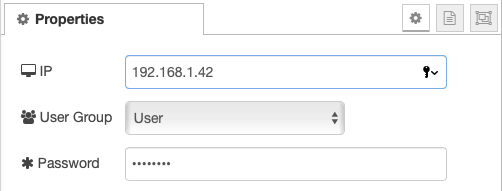
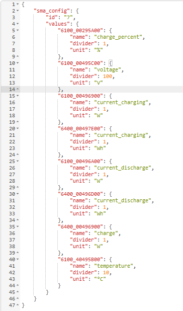
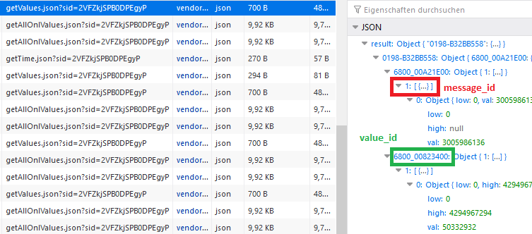
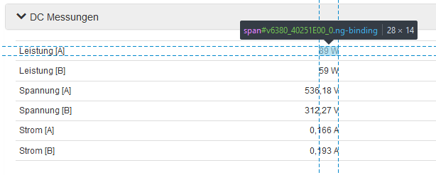

# node-red-contrib-sma-webconnect

Node-RED node to query the Webconnect interface of SMA inverters or storage systems.

## Compatibility
The implementation has been tested with an ethernet connected Sunny Tripower 10.0 but should work with various similiar models. I'm happy to compile a compatiblity list of successfully tested models here.

## Install

```
npm install node-red-contrib-sma-webconnect
```

## Configure

Configure the IP address, user group and password in the node properties. Uncheck the "Use HTTPS connection" checkbox if your device doesn't support HTTPS.



### Configure Input

The node needs a payload to be inserted so it knows which message and what values it should read from the unit.



* `id`: tells the node which message contains the values
* `values`: lists all messages that should be read
  * `name`: custom name of read value
  * `divider`: set the divider of the read value
  * `unit`: unit of read value 

`id` and `values` can easily be found by connecting to the webinterface and using the browser DEV-Tools to inspect the values displayed on the `/spotvalues` page.

## Example message payloads

### Input

```json
{
    "id": "1",
    "values": {
        "6100_0046E500": {
            "name": "phase1_voltage",
            "divider": 100,
            "unit": "v"
        },
        "6100_0046E600": {
            "name": "phase2_voltage",
            "divider": 100,
            "unit": "v"
        },
        "6100_0046E700": {
            "name": "phase3_voltage",
            "divider": 100,
            "unit": "v"
        },
        "6100_40463600": {
            "name": "grid_feedin",
            "divider": 1,
            "unit": "W"
        },
        "6100_40463700": {
            "name": "grid_consumption",
            "divider": 1,
            "unit": "Wh"
        },
        "6100_40263F00": {
            "name": "power",
            "divider": 1,
            "unit": "W"
        }
    }
}
```

### Output

```json
{
  "phase1_voltage": {
    "value": 230.00,
    "unit": "V"
    },
  "phase2_voltage": {
    "value": 230.00,
    "unit": "V"
    },
  "phase3_voltage": {
    "value": 230.00,
    "unit": "V"
    },
  "grid_feedin": {
    "value": 350,
    "unit": "W"
    },
  "grid_consumption": {
    "value": 0,
    "unit" :"W"
    },
  "power": {
    "value": 3600,
  "unit": "W"
  },
}
```

## How to find `message` an `value` id

This section shows you how to get the `message` and `value ids` the node needs in the input payload to read values from the devices.

1. connect to the webinterface of you device, i.e. `http(s)://192.168.1.42/#/login`
2. got to the overview section of your device, i.e. `http(s)://192.168.1.42#/spotvalues`
3. open your browser developertools
4. get the `message id` of your device by opening the network tab of the dev tools and selecting the XHR filter
    * select one of the responses from the `/getValues.json` endpoint
    
    * the red is your `message id`, the green a `value id`
5. get the `value id` of your wanted values by using the inspect function of the dev tools
    * open on of the accordeons and search for the values you want to read
    * use the inspection tool to select the displayed value and view the `value id`

      * the value id should be a 13 character long string, in this example it's `6380_40251E00`

## Login sessions
In my testings I've ran into problems with the maximum number of sessions the webserver supports (4 in my case). The node creates a session and reuses that until the node is restarted or the session expires. If you're using a reasonable small interval (I'm using 5 seconds) to query the inverter the session normally shouldn't expire. Otherwise a session expires after around 6,5 hours according to my testings. But it may happen that a created session get's lost when the node is stopped ungracefully. Logins to the web interface via a web browser count against the same session limit as well.

## Network requirements
This node tries to collect the metrics very agressively, i. e.:
* short network timeouts of 1500ms
* timed out requests are retried after 100ms
* retries are attempted 3 times

